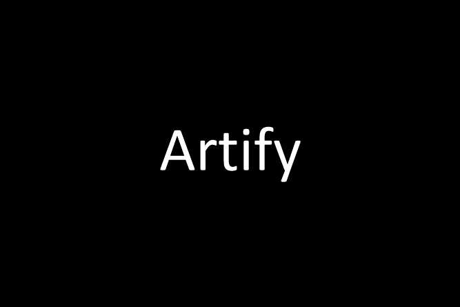
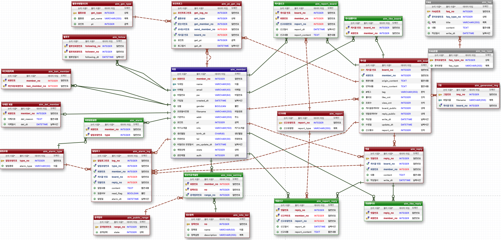

# Artify

> **네이버 클라우드 캠프 1기**   개발 기간 : 2023-04-01 ~ 2023-05-04

## 멤버 구성

> 신지윤 [@zyoonshin](https://github.com/zyoonshin), 오병현 [@ohbyunghyun](https://github.com/ohbyunghyun), 윤종광 [@jongkwangyun](https://github.com/jongkwangyun), 전태산 [@fshrimp](https://github.com/fantasyshrimp), 한대호 [@das7945](https://github.com/das7945)

## 소개

> **Artify**는 **AI그림 생성 서비스** 입니다.

## 주제 선정 이유

> 인스타, 페이스북 같은 sns는 있지만, 이는 작성자가 본인이 표현하고 싶은 내용을 **글로 표현**하는 플랫폼 입니다. 그러나 Artify는 본인이 표현하고 싶은 내용을 입력창에 입력하면, AI가 이를 **그림으로 표현**해줍니다.    Artify는 그림으로 사용자 간의 자유로운 의사 소통과 정보공유 등을 통해 사회적 관계를 생성하고 소통을 강화시켜주는 온라인 플랫폼 입니다.

## Stacks 📚

### Tools 🛠️

### Language 💌

## Naver Cloud ☁️

- VPC
- Server
- Object Storage
- Cloud DB for MySQL

## AI Service 💻

- Stable Diffusion API
- CLOVA Summary (Naver Cloud AI Service)
- Papago Translation (Naver Cloud AI Service)

## Prototype

> Figma : https://www.figma.com/file/UwoJlyVR5gidLHMGsa1caY/Untitled?t=Ne6edFYJB6gtG90N-0

## ERD

## 기능

### Home

### Feed

### F&Q

### Alarm

### Profile

## 2023-03-02 목

### 첫 아이디어 회의

1. 오늘 점심 뭐먹지 - 전태산
2. 암 환자 커뮤니티 - 한대호
3. 클라우드 펀딩 커뮤니티 - 오병현
4. 축의금 관리 시스템 - 전서린
5. 비건 커뮤니티 - 윤종광
6. stable diffusion AI 다루는 커뮤니티 아이디어 제시

## 2023-03-06 월

### 03/10(금) 발표 대비 회의

- Use-case 모델 발표
  - Actor 식별
  - Use-case 식별
- 상세 UI 프로토타입 발표
  - 주요 Use-case의 CRUD UI 프로토타입

주제: 글을 적으면 그림으로 표현해주는 소셜미디어
목표: 각자 생각하는 페이지 구성 및 레이아웃을 노트, PPT, 피그마 등으로 작성해서 좋은 아이디어 도출
페이지 예시: 메인, 로그인, 피드, 마이페이지 등
기한: 2023-03-07 까지

## 2023-03-09 목

### 개별 제작 프로토타입 공유

- 각자 Use-case 생각해서 디스코드에 공유하기. 예) 이용자 → 회원가입
- 3/10(금) 발표 : 전태산

## 2023-03-14 화

### 3/16(목) 발표 대비 회의

- 발표 주제: UI 프로토타입 완성본 발표

- 개별 작업해야할 것

1. 피그마 UI 프로토타입 구현: 클릭시 이동, 모달창, 탭, 스크롤 등. 보내는 것까지 구역 담당자가 할 것
2. 본인 작업간 의견 있으면 반영하거나 댓글 남기기
3. Use-case 수정, 작업분할구조도 수정

### 3/21(화) DB 모델링 발표 대비 회의

- 발표 주제: DB 모델링 발표 및 피드백

- 개별 업무:

1. 각자 공부해서 eXERD 에 수정할 것, 제안 등 의견 작성하기

## 2023-03-27 월

### 1차 리뷰(3/31(금)) 대비 회의 1

- 회의 주제: 프로젝트 진행 방향 및 1차 리뷰 대비 계획

  - 프로젝트 진행 방향 : HTML 로 하지 않고 React 로 바로 컴포넌트 작성한다.

- 역할 분담

1. index, 로그인, 회원가입, 게시글 작성 : 윤종광
2. 피드, 게시글 클릭시 모달창 : 오병현, 한대호
3. 내 프로필(팔로워, 팔로우 등) : 전태산, 신지윤
4. 설정 : 추후 진행
5. 고객센터, 관리자 및 통계 페이지 : 추후 진행

→ 각자 부딪혀 보고 현황 파악해서 어려운 점, 개선 점 내일(3/28(화)) 다시 논의

- 해야할 일

1. 피드 피그마 디자인 확정 필요
2. 신규 추가 페이지 피그마 디자인 확정 필요(고객센터, 관리자 및 통계 페이지)
3. 일정 관리 시트 작성

## 2023-03-31 금

### 1차 리뷰(3/31(금)) 이후 회의

- 회의 주제: 리뷰 결과 및 타 팀 참고하여 소스 수정사항 선정

- 역할 분담

1. 신지윤 : 인덱스 페이지 구성
2. 윤종광 : 로그인 정보 요청 함수 작성, 로그인시 사용자 정보 클릭 모달창 구현
3. 전태산 : 팔로워, 팔로잉 UI 구체화
4. 오병현 : 게시글 상세보기 구체화
5. 한대호 : FAQ 페이지 구성, DB에 FAQ 데이터 넣기

## 2023-04-03 월

### 2차 리뷰(4/7(금)) 대비 회의 1

- 회의 주제: 2차 리뷰 전 구현 필요사항 분담 및 코드 정리 논의
- 논의 내용: 주 3회 월수금 점검 하기로 함.

- 역할 분담

1. 신지윤 : 인덱스 페이지 세부 수정 및 추가
2. 오병현 : 좋아요 처리 다듬기, 불합리한 코드 정리
3. 윤종광 : 알림 아이콘 및 창 구현, AI 이미지 생성 구현
4. 전태산 : 팔로워 및 팔로잉 UI 구체화, 설정 페이지 UI 구상
5. 한대호 : FAQ 데이터 DB에 입력, 관리자 페이지(회원, 게시글, 댓글)

- 수정 필요 사항

1. api/boards 주소 boards 로 수정
2. Board.java 에 Member 객체 넣는 것으로 변경
3. aim_board 에 summary-content 컬럼 및 Board.java 에 summaryContent 필요
4. aim_faq_type PK AutoIncrement 적용 필요
5. 색깔 변수 사용 필요
6. 프로필 사진 default 지정 필요
7. 404 Not Found 페이지 구상 필요

## 2023-04-05 수

### 2차 리뷰(4/7(금)) 대비 회의 2

- 회의 주제: 현재까지 진행사항 공유 및 해야할 일 분담

- 역할 분담

1. 신지윤 : 인덱스 페이지 세부 수정, 관리자 페이지(회원, 게시글, 댓글) 구상
2. 오병현 : 비회원은 상세보기시 로그인 창 뜨도록 수정, 검색 기능 구상
3. 윤종광 : 알림 기능 구체화, AI 이미지 생성되는지 확인
4. 전태산 : 팔로우 주체 수정 필요, 설정 페이지 UI 구상
5. 한대호 : FAQ UI 진행 및 구현

- 수정 필요 사항

1. build.gradle 에 Gson 라이브러리 추가로 gradle eclipse 입력 필요
2. 관리 모드 추가 필요

## 2023-04-07 금

### 2차 리뷰(4/7(금)) 이후 회의

- 회의 주제: 현재까지 진행사항 공유 및 해야할 일 분담

- 역할 분담

1. 신지윤 : 인덱스 페이지 세부 수정, 관리자 페이지(회원, 게시글, 댓글) 구현, 아이디/비번 찾기, README 개요 추가
2. 오병현 : 피드 세부 수정, 게시글, 댓글 신고 숨김 처리 알고리즘 적용, 게시글 공개 설정, 게시글 및 댓글 작성 시간 몇 시간 전으로 변경
3. 윤종광 :
   AI 이미지 생성시 Object Storage 업로드 가능 여부 확인, 회원가입시 이메일 인증 및 네이버, 구글 계정으로 가입 기능 구현, 관리자 모드 기능 구상
4. 전태산 : 내 프로필 사진 변경 기능 구현 및 세부사항 수정, 정보 공개 세팅 및 개별 알림 설정 구현
5. 한대호 : FAQ 세부 수정, 관리자 FAQ 추가 기능 구상, 통계 페이지 구상

- 수정 필요 사항

1. 공개 범위 3단계에서 2단계(비공개 또는 전체 공개)로 변경
2. 로그인 모달에서 회원가입 링크 및 반대도 추가 필요
3. 아이디 찾기는 회원 정보 입력해서 "a**@**" 이런식으로 나오도록 수정 필요
4. 회원 가입시 정보 공개 세팅 값
   현재: 세팅에 들어가서 DB 에 없을 경우 값 넣도록 되어 있음.
   다른 안: 회원 가입시 기본으로 테이블에 값 넣기.

## 2023-04-10 월

### 3차 리뷰(4/14(금)) 대비 회의 1

- 회의 주제: 현재까지 진행사항 공유, 수정필요 사항 논의 및 해야할 일 분담

- 수정필요 사항

1. 게시물 개별 비공개 처리 불필요한 것으로 판단되어 해당 기능 제거
2. 특정 기능의 알람, 예컨대 댓글 알람 껐을때 DB 의 read_flag 에 해당 댓글 read_flag 수정해서 알람 끔 여부 넣도록 하는 것 논의함. 현재대로 진행 어려울 경우 이 방법 검토
3. 회원 가입 완료시 메일 확인하라고 alert 띄우고 창 바로 닫히도록 수정 필요

- 역할 분담

1. 신지윤 : 인덱스 페이지 세부 수정, 관리자 페이지(회원, 게시글, 댓글) 구현
2. 오병현 : 게시글, 댓글, 좋아요 활동시 포인트 지급되도록 기능 구상
3. 윤종광 : AI 이미지 생성시 Object Storage 업로드 가능 여부 확인, 네이버, 구글 계정으로 가입 기능 구현, GPU Server 로 이미지 생성 가능 여부 확인
4. 전태산 : 프로필, 팔로우 창 UI/UX 다듬기, 정보 공개 세팅 및 개별 알림 설정에 따른 SQL 문 작성
5. 한대호 : FAQ 세부 수정, 관리자 FAQ 추가 기능 구상, 통계 페이지 구상

## 2023-04-12 수

### 3차 리뷰(4/14(금)) 대비 회의 2

- 회의 주제: 현재까지 진행사항 공유, 수정필요 사항 논의 및 해야할 일 분담

- 수정필요 사항

1. Footer 구성 필요
2. 방문자 통계를 위해 별도 테이블 필요
3. 인덱스 페이지에 비디오 + 스크롤시 화려한 애니메이션 적용하기로 함

- 역할 분담

1. 신지윤 : admin 페이지 일반 사용자 차단 백엔드 서버에서 구현
2. 오병현 : 키워드 추출로 태그 사용 가능한지 검토, 피드 상세 페이지에서 배경 스크롤 안되게 수정 필요
3. 윤종광 : GPU Server 로 이미지 생성 가능 여부 확인
4. 전태산 : 프로필, 팔로우 창 UI/UX 다듬기, 정보 공개 세팅 및 개별 알림 설정에 따른 SQL 문 작성
5. 한대호 : 관리자 FAQ 추가 기능 구현, 통계 페이지(방문자, 가입자, 일 게시글, 일 댓글 수) 구현

## 2023-04-17 월

### 4차 리뷰(4/21(금)) 대비 회의 1

- 회의 주제: 현재까지 진행사항 공유, 수정필요 사항 논의 및 해야할 일 분담

- 수정필요 사항

1. 튜토리얼 페이지 우리 앱과 맞지 않아 구현하지 않기로 함

- 역할 분담

1. 신지윤 : admin 페이지 일반 사용자 차단 백엔드 서버에서 구현
2. 오병현 : 키워드 추출로 태그 자동화 구현
3. 윤종광 : GPU Server 로 이미지 생성 기능 구현
4. 전태산 : 색깔 변수 사용으로 다크모드 구현
5. 한대호 : 통계 페이지(방문자, 가입자, 일 게시글, 일 댓글 수) 구현

## 2023-04-20 목

### 4차 리뷰(4/21(금)) 대비 회의 2

- 회의 주제: 현재까지 진행사항 공유, 수정필요 사항 논의 및 해야할 일 분담

- 수정필요 사항

1. 게시글 수정 우리 앱과 맞지 않아 기능 미구현하기로 함
2. 반응형, alert, 다크모드 4/24 이후 적용
3. 클라우드에 서버 올리는 것 4/26 이후 적용

- 역할 분담

1. 신지윤 : 관리자 페이지 구현, 인덱스 페이지 구체화
2. 오병현 : Footer 구상, 팔로워, 로그인 보너스 모달 배경 스크롤 막기, Random 버튼 추가, 태그 중복, 띄어쓰기 제거
3. 윤종광 : 비밀번호 찾기 구현, 프로필 기본 사진 구현
4. 전태산 : 다크모드 구현 및 SweetAlert2 적용
5. 한대호 : 통계 페이지(방문자, 가입자, 일 게시글, 일 댓글 수) 구현
